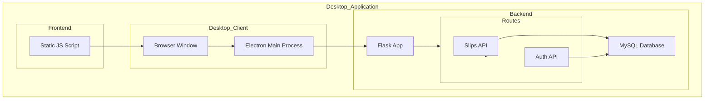

    

    <b>Automatic Architecture Diagrams from Code</b> 
    <a href="https://github.com/swark-io/swark">GitHub</a> • <a href="https://swark.io">Website</a> • <a href="mailto:contact@swark.io">Contact Us</a>

## Usage Instructions

1. **Render the Diagram**: Use the links below to open it in Mermaid Live Editor, or install the [Mermaid Support](https://marketplace.visualstudio.com/items?itemName=bierner.markdown-mermaid) extension.
2. **Recommended Model**: If available for you, use `claude-3.5-sonnet` [language model](vscode://settings/swark.languageModel). It can process more files and generates better diagrams.
3. **Iterate for Best Results**: Language models are non-deterministic. Generate the diagram multiple times and choose the best result.

## Generated Content
**Model**: GPT-4o - [Change Model](vscode://settings/swark.languageModel)  
**Mermaid Live Editor**: [View](https://mermaid.live/view#pako:eNptUsFuwjAM_ZUo5_EDPUyCdUibhsTWSTu0CIXU0Ig0qRJHCCH-fUlDCwF8iOznZ8d5zolyXQPNaKV2hnUN-c0rRbxZt4lADnaPultPu04KzlBoFRkJa260QlD1NRXss1gX3IgOywJ9JfcAicDqSkyqxoYzxvcP_fwM5Vwyuw_eKs3lDNmGWSgXx-L7awzvWGP_H-0QbJoMVkjR2bI_yXT5sXpkTB02ZTie5JOJnz9s0PNNClCYlr9L4OiVDGKXQ0AWTCiyNJqDtXf3zYw-WDDrP6FqfSgvIYnhM417J7rjcshk8nrXKTJSrKfdThhJt0hPGTMDcCt19Hu41_gBDcJGMO4gYMMuL22D9ClMX2gLpmWi9j_5VFFsoIWKZqSiNWyZk1jRsye5rmYIuWB-FS3N0Dh4ocyhLo6KD7HRbtfQbMukhfM_2eLzAw) | [Edit](https://mermaid.live/edit#pako:eNptUsFuwjAM_ZUo5_EDPUyCdUibhsTWSTu0CIXU0Ig0qRJHCCH-fUlDCwF8iOznZ8d5zolyXQPNaKV2hnUN-c0rRbxZt4lADnaPultPu04KzlBoFRkJa260QlD1NRXss1gX3IgOywJ9JfcAicDqSkyqxoYzxvcP_fwM5Vwyuw_eKs3lDNmGWSgXx-L7awzvWGP_H-0QbJoMVkjR2bI_yXT5sXpkTB02ZTie5JOJnz9s0PNNClCYlr9L4OiVDGKXQ0AWTCiyNJqDtXf3zYw-WDDrP6FqfSgvIYnhM417J7rjcshk8nrXKTJSrKfdThhJt0hPGTMDcCt19Hu41_gBDcJGMO4gYMMuL22D9ClMX2gLpmWi9j_5VFFsoIWKZqSiNWyZk1jRsye5rmYIuWB-FS3N0Dh4ocyhLo6KD7HRbtfQbMukhfM_2eLzAw)

